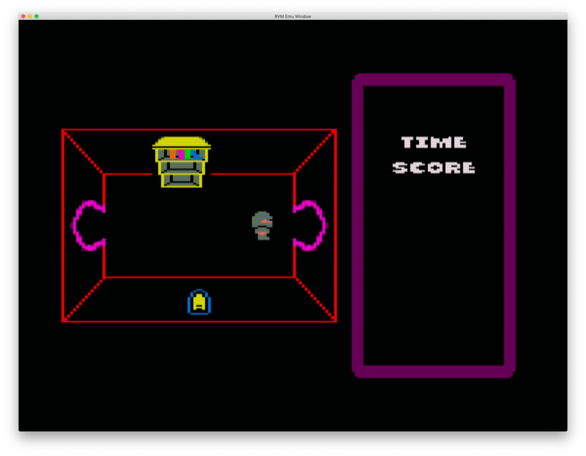
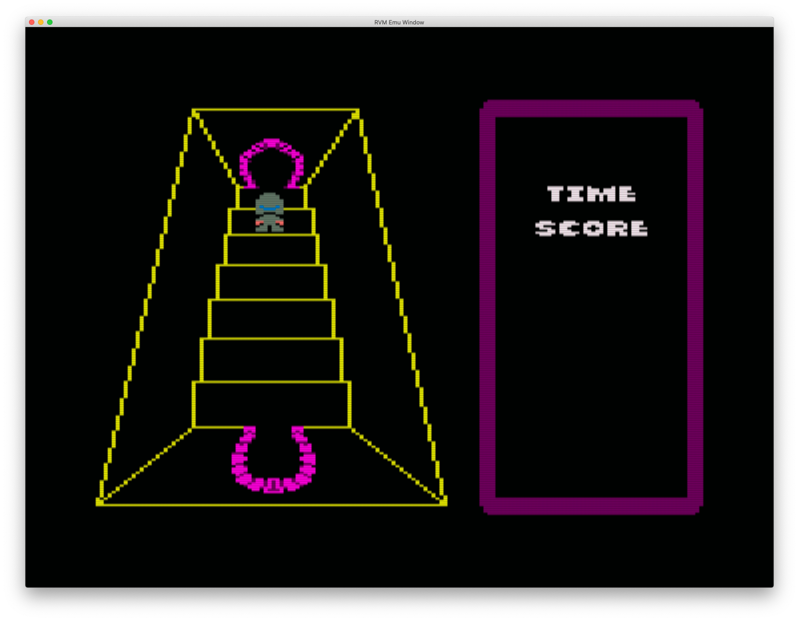
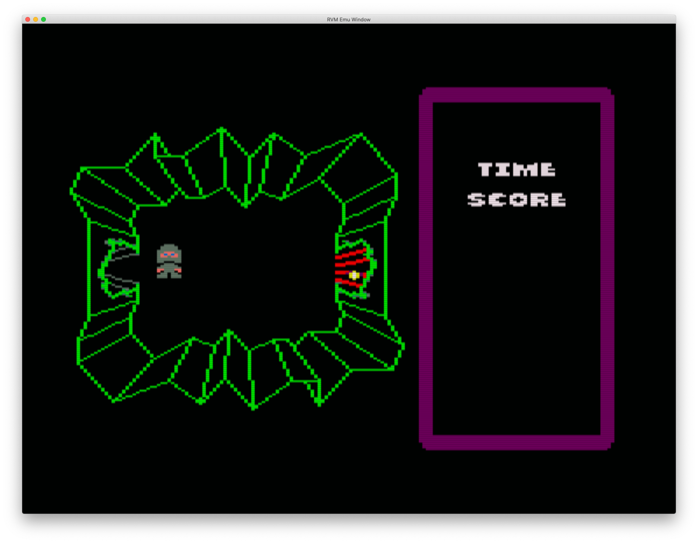

To build using RetroVirtualMachine2:

a atic.asm

And then in the emulator:

call &1000

Cursor keys to move, G to return to first screen

V to toggle interrupt timings in border

Thanks to this site for the info on the data formats:

http://icemark.com/dataformats/aticatac/index.html

