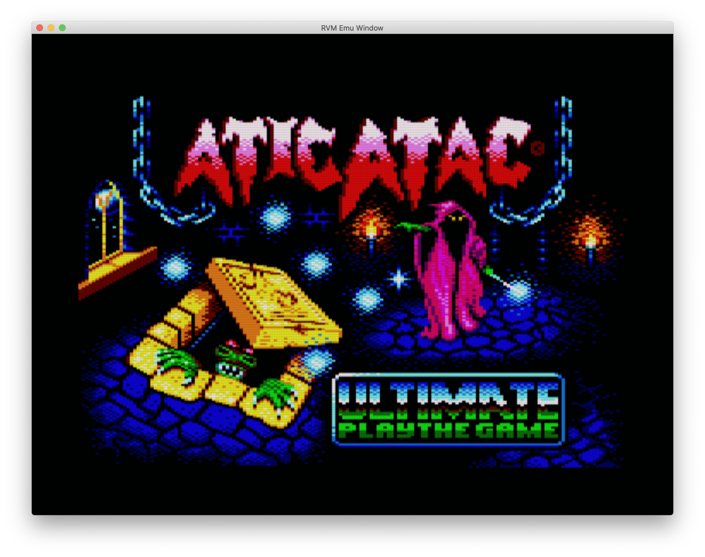
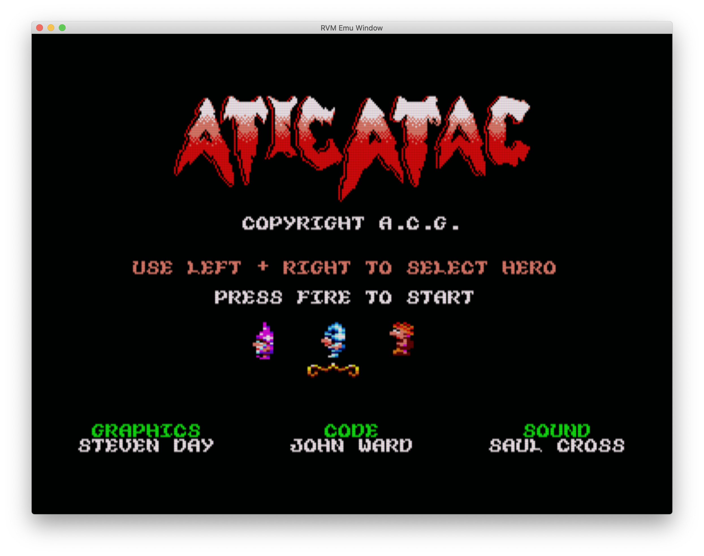
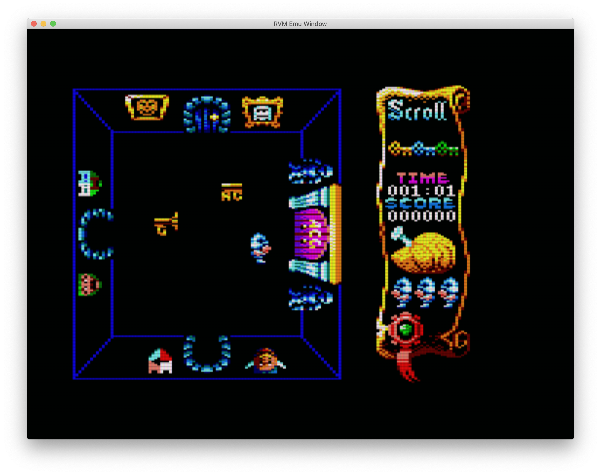

Insert the aticatac.dsk disk into the 6128 emulator (not yet tested on 64K machine with memory expansion)

In the emulator: run"atic

Joystick left and right to select player (or cursor keys)

Joystick button 1 or Space to start

Joystick or cursor keys to move

Joystick button 2 or Z to pick up items

H to pause game

M return to menu

Thanks to this site for the info on the data formats:
http://icemark.com/dataformats/aticatac/index.html

Sound and music (and playback) thanks to Arkos Tracker 2:
http://www.julien-nevo.com/arkostracker/

